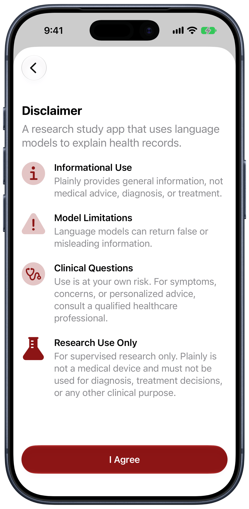
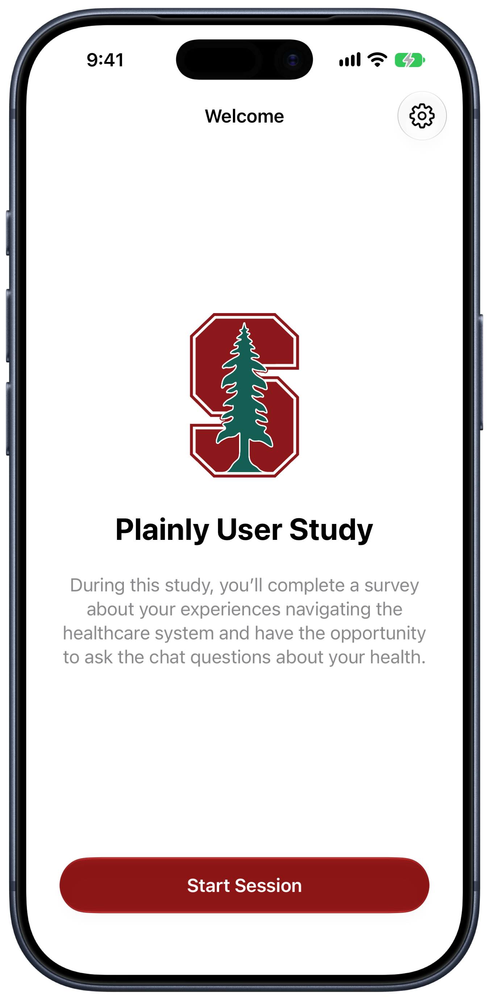
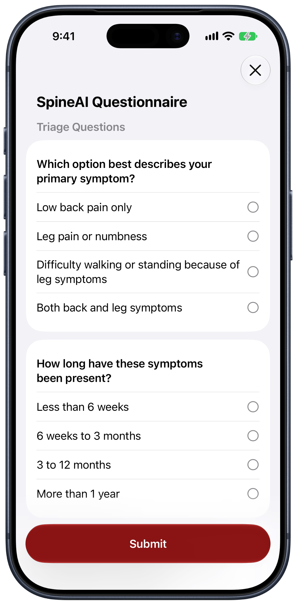
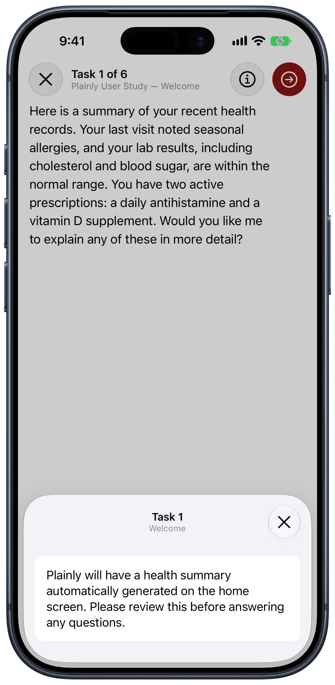
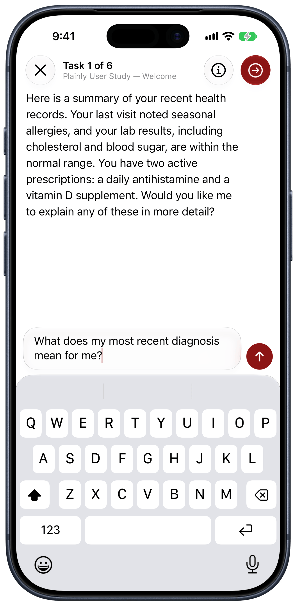

<!--

This source file is part of the Plainly iOS open-source project

SPDX-FileCopyrightText: 2023 Stanford University and the project authors (see CONTRIBUTORS.md)

SPDX-License-Identifier: MIT

-->

# Plainly

[](https://github.com/SchmiedmayerLab/Plainly-iOS/actions/workflows/build-and-test.yml)
[](https://github.com/SchmiedmayerLab/Plainly-iOS/actions/workflows/deployment.yml)
[](https://codecov.io/gh/SchmiedmayerLab/Plainly-iOS)
[](https://api.reuse.software/info/github.com/SchmiedmayerLab/Plainly-iOS)
[](LICENSE.md)

## Study Overview

Plainly is an experimental iOS app for a consented Stanford research study. It evaluates whether conversational artificial intelligence can help participants understand FHIR-formatted health records and navigate the healthcare system.

During a study session, participants complete study surveys and can ask questions about health records made available through Apple Health. Plainly generates summaries and explanations using language models; it does not provide medical advice, diagnosis, or treatment.

> [!IMPORTANT]
> Plainly is only for invited participants who have completed the study consent process. Do not install or use the app outside the study. The signed consent form, HIPAA authorization, and other study information govern participation and the handling of participant information.

<table style="width: 80%">
  <tr>
    <td align="center" width="33.33333%"><picture><source media="(prefers-color-scheme: dark)" srcset="docs/screenshots/Welcome~dark.png"></picture></td>
    <td align="center" width="33.33333%"><picture><source media="(prefers-color-scheme: dark)" srcset="docs/screenshots/Disclaimer~dark.png"></picture></td>
    <td align="center" width="33.33333%"><picture><source media="(prefers-color-scheme: dark)" srcset="docs/screenshots/Study~dark.png"></picture></td>
  </tr>
  <tr>
    <td align="center">Welcome</td>
    <td align="center">Research Disclaimer</td>
    <td align="center">Study</td>
  </tr>
  <tr>
    <td align="center" width="33.33333%"><picture><source media="(prefers-color-scheme: dark)" srcset="docs/screenshots/Questionnaire~dark.png"></picture></td>
    <td align="center" width="33.33333%"><picture><source media="(prefers-color-scheme: dark)" srcset="docs/screenshots/Instructions~dark.png"></picture></td>
    <td align="center" width="33.33333%"><picture><source media="(prefers-color-scheme: dark)" srcset="docs/screenshots/Chat~dark.png"></picture></td>
  </tr>
  <tr>
    <td align="center">Questionnaire</td>
    <td align="center">Task Instructions</td>
    <td align="center">Chat</td>
  </tr>
</table>

## Build and Run the Application

You can build and run the application using [Xcode](https://developer.apple.com/xcode/) by opening **Plainly.xcodeproj**.

For development without participant data, the app includes [Synthea](https://pubmed.ncbi.nlm.nih.gov/29025144/)-based synthetic patients.

All chat requests are dispatched to the Firebase `chat` function, which holds the inference credentials and resolves the provider and endpoint from the model identifier a study defines. The app never talks to an inference API directly, so local testing requires either the Firebase emulator (see below) or the staging backend.

When running Plainly via Xcode, you can use the `--mode` CLI flag to control the behavior of the app (configurable via the Run scheme):
- `--mode test` loads the bundled synthetic patients instead of health records;
- `--mode study:<study-id>` launches Plainly into its study mode, loads the study with the specified ID from `PlainlyStudyDefinitions`, and automatically opens it;
- `--mode study` launches Plainly into its study mode, showing a "Scan QR Code" button to select and open a study.

### Screenshots

The App Store pictures come from `fastlane screenshots`, which walks the first row on an iPhone and an iPad and checks sizes and count; a production deployment takes them again from the build it ships. The README pictures add the questionnaire, the task instructions and the chat, with the Firebase emulator answering, framed through [RocketSim](https://www.rocketsim.app) in light and dark appearance:

```bash
scripts/readme-screenshots.sh
```

### Firebase End-to-End Test

The Firebase emulator UI test exercises anonymous authentication, streaming chat through the callable function, and study-report upload to Storage without any real inference credentials:

```bash
scripts/run-firebase-e2e.sh
```

The script initializes the `Plainly-Firebase` submodule, starts the local emulators with a deterministic OpenAI-compatible response, and runs only the dedicated end-to-end UI test.

To run the app itself against the emulator, launch it with `--useFirebaseEmulator`.
Point the emulator at a real gateway by putting that key in `Plainly-Firebase/functions/.secret.local`, and — since a development key is rarely entitled to every model a deployment uses — pass `--llmModel <identifier>` to request one it can reach instead of the one the study pins.
Both are ignored outside the emulator: the model a study runs on is part of what that study collects.


### UserStudyConfig.plist File

Everything a study *does* — its prompts, tasks, model, retrieval, and chat function — is defined by the `Study` type in `PlainlyStudyDefinitions` and versioned with the code.
The UserStudyConfig.plist file therefore carries only what cannot live in an open-source repository:
- Firebase configuration: connects the app to a Firebase environment for chat responses and study report uploads
- app launch mode: controls how the app behaves upon launch (e.g., whether to directly launch a study)

The file bundled with the repository carries placeholder Firebase credentials and must be regenerated for a real deployment.
Use the `export-config` tool in the PlainlyShared folder to do so:
```bash
swift run PlainlyCLI export-config -f ~/GoogleService-Info.plist ../Plainly/Supporting\ Files/UserStudyConfig.plist
```

Study reports are uploaded to Firebase Storage. A report that cannot be uploaded is kept in Application Support, surfaced on the study home screen, and retried when the participant returns to that screen or relaunches the app.

### Screening

A study's initial questionnaire can decide on its own whether the study goes on. It computes one of three codes from Plainly's `screening-outcome` code system, `eligible`, `ineligible` or `needs-attention`, into a hidden item tagged with the `screening-outcome` item code, using an SDC `calculatedExpression`; the pages that follow are gated with `enableWhenExpression`s on the same rules, so the questionnaire ends on the page that tells the participant what to do. The SpineAI intake is the reference: its rules are declared once as FHIRPath `variable`s on the questionnaire. A cauda equina symptom or severe leg weakness needs attention and stops the questionnaire; an injury, a cancer or an infection flag only adds a page of advice, the most urgent one when several apply, and the study goes on.

The app reads the outcome once the questionnaire completes. `eligible` continues into the chat. Anything else uploads the answers as the session's report, records the decision with the `Screening` module so it survives relaunches, and replaces the study home with a page that puts medical help first and points to the study coordinator.

### Study Uploads

Reports land in the production bucket under `studies/<study>/reports/`; older builds put them under `studies/<study>/users/<uid>/`. [`scripts/download-study-uploads.sh`](scripts/download-study-uploads.sh) pulls a study's reports into one flat folder per study, renaming the older ones from their content and upload time so they sort with the rest, and leaves the RAG files alone. `--project` names the Firebase project whose default bucket holds the studies, and `--study all` takes every study in it:

```bash
scripts/download-study-uploads.sh --project <firebase project> --study edu.stanford.LLMonFHIR.gynStudy
```

The script uses the [Google Cloud CLI](https://cloud.google.com/sdk/docs/install), `brew install --cask google-cloud-sdk`, and asks you to sign in the first time. Files go to `study-uploads/<study>/`, which git ignores; a second run only fetches what is new. They contain study data.

## Session Simulation

The PlainlyShared subpackage contains a tool that lets you simulate user chat sessions.

During a simulated chat session, the LLM is provided with the same context and data it would receive during normal app usage, except that the inputs (both the patient's health records and the questions being asked by the user) are predefined.
This allows you to evaluate how different models (or even the same model across multiple conversations) handle various scenarios and situations.

For each simulated session, a report file is generated with the same structure as the report files generated during regular app sessions.

```bash
swift run PlainlyCLI simulate-session config.json output/
```

Simulated sessions reach the model the same way the app does, through the Firebase `chat` function, so the simulator never holds an inference credential. Point it either at a deployed backend or at a local emulator — [the Plainly-Firebase development guide](https://github.com/SchmiedmayerLab/Plainly-Firebase#development) covers configuring the local secrets and starting the emulators.

Session simulation is controlled via a JSON config file. **Credentials are never stored in the config file** — they are read from environment variables at runtime:

| Service | Required env var |
|---------|-----------------|
| `Firebase` | `GOOGLE_CREDENTIALS_PLIST` (path to `GoogleService-Info.plist`) |
| `Firebase-Emulator` | *(none — connects to the local emulator suite)* |

Additional optional environment variables:

| Env var | Default | Effect |
|---------|---------|--------|
| `FIREBASE_REGION` | `us-central1` | Firebase Functions/Auth region |
| `FIREBASE_PROJECT_ID` | `demo-project` | Project ID override for the emulator when `GOOGLE_CREDENTIALS_PLIST` is not set (emulator mode only) |
| `FIREBASE_AUTH_EMULATOR_HOST` | `localhost:9099` | Auth emulator address (`host:port`) |
| `FIREBASE_FUNCTIONS_EMULATOR_HOST` | `localhost:5001` | Functions emulator address (`host:port`) |

Each entry in the JSON config defines the parameters of one simulation:
- `numberOfRuns` — how many times to repeat this session
- `studyId` — the study whose prompts and context to use
- `bundleName` — name of an embedded synthetic patient, or a path to a FHIR bundle JSON file (resolved relative to the config file)
- `model` — the model identifier to request
- `userQuestions` — the questions the simulated patient asks
- `service` *(optional)* — `"Firebase"` or `"Firebase-Emulator"`; if omitted, inferred from the environment (`GOOGLE_CREDENTIALS_PLIST` → Firebase, otherwise Firebase-Emulator)
- `name` *(optional)* — human-readable label used as the output filename prefix
- `comment` *(optional)* — free-form note describing the config, carried through to the report
- `customSystemPrompt` *(optional)* — custom system prompt, replaces the study's default system prompt
- `customResourcePrompt` *(optional)* — custom prompt controlling how individual FHIR resources are summarized

The example config below performs six simulated runs of the `edu.stanford.plainly.gynStudy` study with GPT-4o, three against a deployed backend and three against the local emulator:
```json
[{
    "numberOfRuns": 3,
    "name": "gyn-gpt4o-firebase",
    "studyId": "edu.stanford.plainly.gynStudy",
    "bundleName": "Elena Kim",
    "model": "gpt-4o",
    "service": "Firebase",
    "userQuestions": [
        "Tell me about my recent diagnoses and how they affect my fertility.",
        "How are my hormonal levels?"
    ]
}, {
    "numberOfRuns": 3,
    "name": "gyn-gpt4o-emulator",
    "studyId": "edu.stanford.plainly.gynStudy",
    "bundleName": "Elena Kim",
    "model": "gpt-4o",
    "service": "Firebase-Emulator",
    "userQuestions": [
        "Tell me about my recent diagnoses and how they affect my fertility.",
        "How are my hormonal levels?"
    ]
}]
```

Run against a deployed backend:

```bash
GOOGLE_CREDENTIALS_PLIST=~/GoogleService-Info.plist
swift run PlainlyCLI simulate-session config.json output/
```

Or against the emulator suite, once it is running:

```bash
FIREBASE_PROJECT_ID=...
swift run PlainlyCLI simulate-session config.json output/
```

Reports are saved to a timestamped subdirectory inside the output directory, named `<index>-<name>-<run>.json` (e.g. `00-gyn-gpt4o-firebase-1.json`).

## Contributing

Contributions to this project are welcome. Please make sure to read the [contribution guidelines](https://github.com/SchmiedmayerLab/.github/blob/main/CONTRIBUTING.md) and the [contributor covenant code of conduct](https://github.com/SchmiedmayerLab/.github/blob/main/CODE_OF_CONDUCT.md) first. You can find a list of contributors in the [CONTRIBUTORS.md](CONTRIBUTORS.md) file.

## License

This project is licensed under the MIT License. See [LICENSE.md](LICENSE.md) for more information.

## Citation

If you use this software, please cite it using the metadata in [CITATION.cff](CITATION.cff), which GitHub surfaces through the [*Cite this repository*](https://docs.github.com/en/repositories/managing-your-repositorys-settings-and-features/customizing-your-repository/about-citation-files) button.

## Our Research

For more information, visit the [Schmiedmayer Lab GitHub organization](https://github.com/SchmiedmayerLab).


